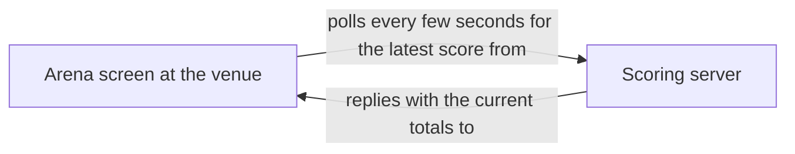
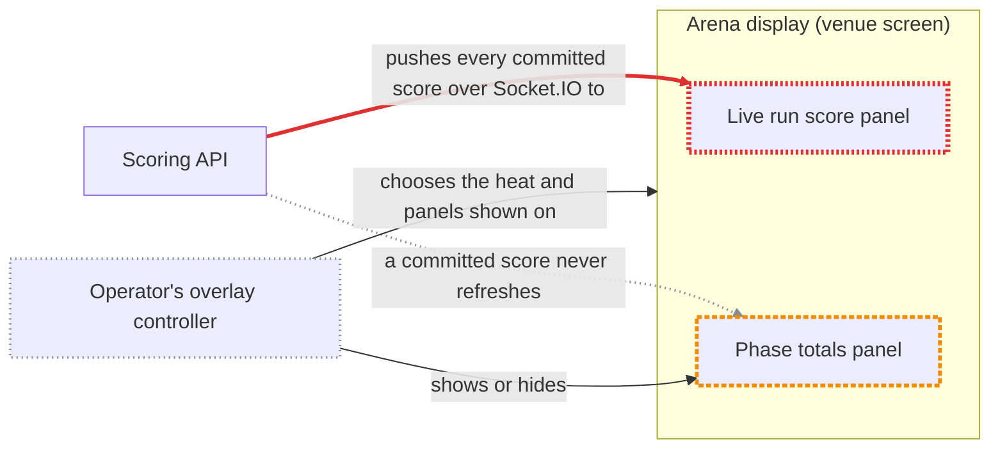
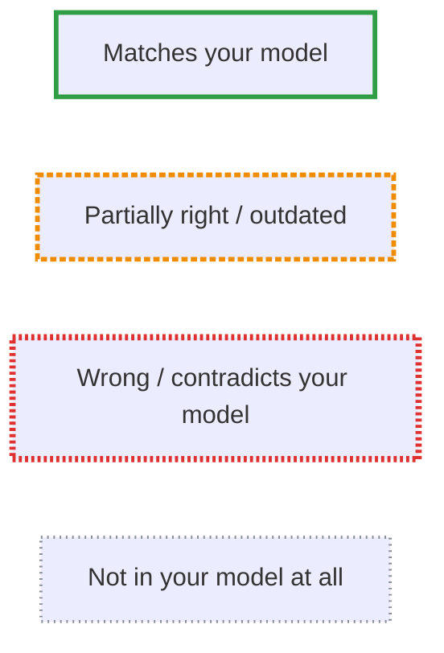

# Lumberjack

> Jumping from branch to branch, as they float down the mighty stream from dev to prod. Lumberjack lets you see the wood for the trees, and develop with confidence.

Codebases are evolving faster than ever, with each line having less eyeball-time than ever before. This means developers’ mental models fall out of sync rapidly. Lumberjack clears that overgrowth before you build — by comparing what you think the system does with how it actually works.

Now you're probably thinking, doesn't Claude do that anyway? Well it can, but often you end up with verbose walls of text, full of unimportant implementation details, and the wrong terminology that your team doesn't use. Lumberjack cuts through all that, generating graded Mermaid diagrams that clearly show you where your mental model is wrong.

## Skills

- **[reality-check](skills/reality-check/SKILL.md)** — describe your mental model of a codebase area (architecture, deployment, or data flow), and get back a Markdown report with a plain diagram of your model next to a red/amber/green-graded diagram of reality.
- **[grounded-plan](skills/grounded-plan/SKILL.md)** — plan a change to an existing system without building it on a stale picture of that system: grounds your stated understanding against the real code first (via reality-check), then bakes a before/after diagram pair into the implementation plan alongside the normal technical steps.

## Installation

Add this repo as a plugin marketplace, then install the plugin:

```
/plugin marketplace add AntonyM71/Lumberjack
/plugin install lumberjack@lumberjack
```

## Example
A real, unedited result from one of my projects — one claim, checked against the actual code.

# Reality Check: Scoring API to arena display

**Lens:** data flow · **Date:** 2026-08-28 · **Scope:** how a score reaches the arena display at the venue

## TL;DR
- 🔴 Nothing in this path polls. The live run score arrives over an open Socket.IO subscription, and the server pushes it the instant a judge's score commits.
- 🟡 The phase-totals panel skips the timer too — it re-fetches only on mount, on a heat change, or when the operator toggles the panel.
- ⚪ An operator's overlay controller, on a separate `/broadcast_control` socket, decides which heat and panels the arena shows.
- 🟢 The shape holds: one scoring service owns the data and the arena screen only consumes it.

## Your model

The arena screen polls the scoring server every few seconds to fetch the latest score.



## Reality



*Legend:*



## What's off, and why

| Grade | Mental Model | Reality | Evidence |
|---|---|---|---|
| 🔴 | The live score is fetched by polling the server every few seconds | The server emits `current_scores` over Socket.IO the moment a score commits; the panel holds an open subscription and never polls | `Server/app/scoring/customScoringEndpoints.py:205-218` (emit after commit); `Webapp/src/redux/services/streamingApi.ts:141-173` (client socket) |
| 🟡 | The same timed re-fetch keeps the phase-totals panel current | The totals panel re-fetches rather than subscribes, but only on mount, on a heat change, or on an operator panel-toggle — never on a timer | `Webapp/src/components/broadcast/Cards/PhaseResultsTable.tsx:47-61` |
| ⚪ | — | An operator's overlay controller, over a separate `/broadcast_control` socket, sets which heat and panels the arena shows | `Webapp/src/components/arena/arena.tsx:35-55`; `Server/app/broadcastEndpoints.py:26-29` |

## Contributing
Before pushing changes, validate the plugin structure and try it in a real session:

```bash
claude plugin validate .
claude --plugin-dir ./
```

