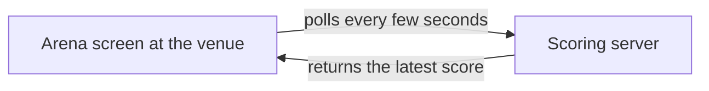
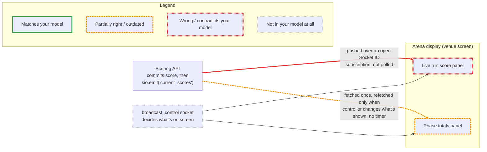

# Lumberjack

> Jumping from branch to branch, as they float down the mighty stream from dev to prod. Lumberjack lets you see the wood for the trees, and develop with confidence.

Codebases are evolving faster than ever, with each line having less eyeball-time than ever before. This means developers’ mental models fall out of sync rapidly. Lumberjack clears that overgrowth before you build — by comparing what you think the system does with how it actually works.

Now you're probably thinking, doesn't Claude do that anyway? Well it can, but often you end up with verbose walls of text, full of unimportant implementation details, and the wrong terminology that your team doesn't use. Lumberjack cuts through all that, generating graded Mermaid diagrams that clearly show you where your mental model is wrong.

## Skills

- **[reality-check](skills/reality-check/SKILL.md)** — describe your mental model of a codebase area (architecture, deployment, or data flow), and get back a Markdown report with a plain diagram of your model next to a red/amber/green-graded diagram of reality.
- **[grounded-plan](skills/grounded-plan/SKILL.md)** — plan a change to an existing system without building it on a stale picture of that system: grounds your stated understanding against the real code first (via reality-check), then bakes a before/after diagram pair into the implementation plan alongside the normal technical steps.

## Installation

Add this repo as a plugin marketplace, then install the plugin:

```
/plugin marketplace add AntonyM71/lumberjack
/plugin install lumberjack@lumberjack
```

## Example
A real, unedited result from one of my projects — one claim, checked against the actual code.

# Reality Check: Scoring API to arena display

**Lens:** data flow · **Date:** 2026-08-28 · **Scope:** how a score gets from the scoring API to the arena display at the venue

## TL;DR
- 🔴 Biggest miss: there's no polling anywhere in this path. The arena's live run score arrives over an open Socket.IO subscription that the server pushes to the instant a judge's score commits.
- 🟡 The arena's other score surface (phase totals table) also isn't on a timer, but it's not pure push either — it refetches on demand only when the broadcast controller changes what's visible.
- ⚪ Gap: what's actually showing on the arena screen at any moment is chosen by a human-operated controller channel, not the display autonomously fetching "whatever's latest."

## Your model

The arena screen polls the scoring server every few seconds to fetch the latest score.



## Reality



## What's off, and why

| Grade | Claim | Evidence |
|---|---|---|
| 🔴 | The arena's live run score is fetched by polling the server every few seconds | `Server/app/scoring/customScoringEndpoints.py:205-218` — `db.commit()` is immediately followed by `await sio.emit("current_scores", scored_data, namespace="/current_scores")`. `Webapp/src/components/broadcast/Cards/LiveRunScore.tsx:75-82` (rendered on the arena screen via `Webapp/src/components/arena/arena.tsx:87-90`) subscribes with `useAthleteMovesAndBonusesStreamQuery`, which opens a live `socket.io-client` connection (`Webapp/src/redux/services/streamingApi.ts:141` → `WebSocketConnections.ts:25-29`) and pushes updates into the Redux cache as they arrive — no interval anywhere in that path. |
| 🟡 | The arena's phase totals table also refreshes by checking back with the server periodically | `Webapp/src/components/broadcast/Cards/PhaseResultsTable.tsx:41-61` — `refetchOnMountOrArgChange: true` plus a `useEffect` keyed on `overlayControlState.showPhaseResults` that calls `refetchPhase()`/`refetchScores()` only when that visibility flag changes. No `setInterval`/`pollingInterval` exists anywhere in `Webapp/src` for score data (the only `setInterval` calls found are `BasicBroadcastTable.tsx:33` for rotating already-fetched table pages, and `PixiFrameSequenceOverlay.tsx:491` for animation frame timing — neither re-fetches score data). |
| ⚪ | What the arena screen currently shows is itself remote-controlled over a separate channel | `Server/app/broadcastEndpoints.py:26-39` (`/broadcast_control` namespace) pushes an `OverlayControlState` that a human-operated controller sets; `Webapp/src/components/arena/arena.tsx:35-91` uses that state to decide which panel/athlete is currently on screen. The display isn't autonomously polling for "whatever's latest" — it's showing whatever the controller has selected. |

## Contributing
Before pushing changes, validate the plugin structure and try it in a real session:

```bash
claude plugin validate .
claude --plugin-dir ./
```

