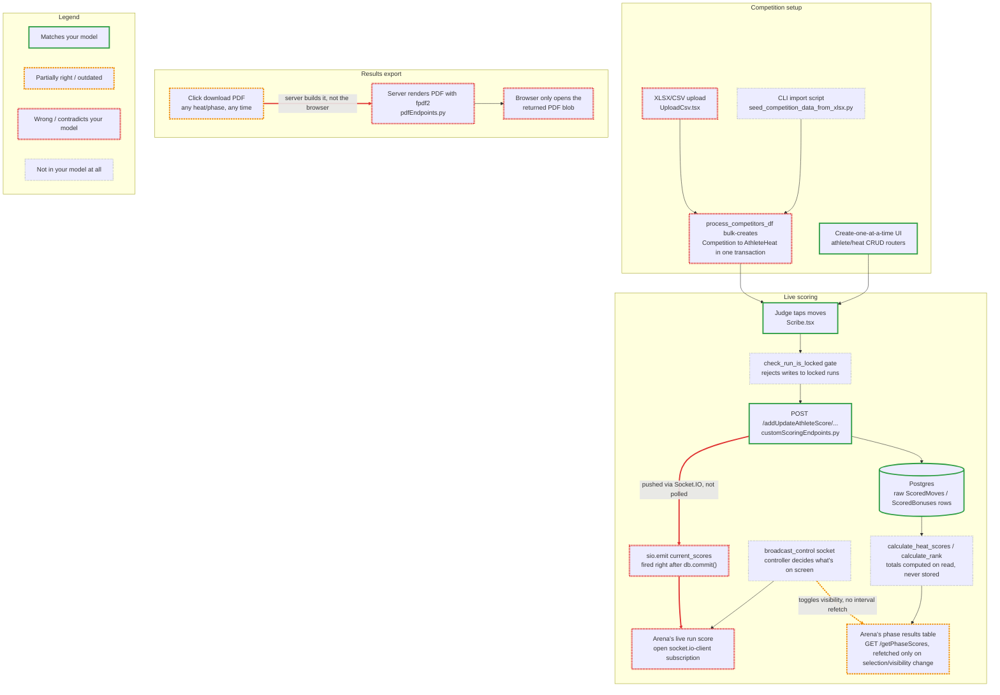

# Lumberjack

> Jumping from branch to branch, as they float down the mighty stream from dev to prod. Lumberjack lets you see the wood for the trees, and develop with confidence.

Codebases are evolving faster than ever, with each line having less eyeball-time than ever before. This means developers’ mental models fall out of sync rapidly. Lumberjack clears that overgrowth before you build — by comparing what you think the system does with how it actually works.

Now you're probably thinking, doesn't Claude do that anyway? Well it can, but often you end up with verbose walls of text, full of unimportant implementation details, and the wrong terminology that your team doesn't use. Lumberjack cuts through all that, generating graded Mermaid diagrams that clearly show you where your mental model is wrong.

## Skills

- **[reality-check](skills/reality-check/SKILL.md)** — describe your mental model of a codebase area (architecture, deployment, or data flow), and get back a Markdown report with a plain diagram of your model next to a red/amber/green-graded diagram of reality.
- **[grounded-plan](skills/grounded-plan/SKILL.md)** — plan a change to an existing system without building it on a stale picture of that system: grounds your stated understanding against the real code first (via reality-check), then bakes a before/after diagram pair into the implementation plan alongside the normal technical steps.

## Example
Here is an example from one of my projects.
### Your model

Judge scoring hits an API that writes straight to Postgres; the arena screen polls that same server every few seconds for updated totals. PDF results are built in the browser when someone clicks "export" once the competition is over. Competitions are built up by hand, one athlete and one heat at a time, with no bulk-loading option.

### Reality


### What's off, and why

| Grade | Claim | Evidence |
|---|---|---|
| 🔴 | Arena display polls the server every few seconds for updated totals | `Server/app/scoring/customScoringEndpoints.py:205-218` — `db.commit()` is immediately followed by `await sio.emit("current_scores", scored_data, namespace="/current_scores")`. `Server/main.py:163` mounts Socket.IO alongside FastAPI (`socketio.ASGIApp(sio, other_asgi_app=app)`). The frontend opens a live socket in `Webapp/src/components/roles/headJudge/WebSocketConnections.ts:25-29` and patches the RTK Query cache directly on the event in `Webapp/src/redux/services/streamingApi.ts:142-173` — no interval anywhere in that path. |
| 🔴 | Competitions can only be set up by manually creating each athlete/heat one at a time — no bulk import | `Server/app/competition_management/create_competition_from_xlsx.py:135-246` (`process_competitors_df`) bulk-creates one Competition, one Event+Phase per event, one Heat per heat, and one Athlete+AthleteHeat per spreadsheet row in a single transaction. Exposed at `POST /upload` (`Server/app/competition_management/competition_management.py:46-67`) and surfaced in the UI as `Webapp/src/components/competition/UploadCsv.tsx:144-151` ("Upload Paddlers from CSV"). `Server/scripts/seed_competition_data_from_xlsx.py` runs the same import from the CLI, outside the running API. Manual one-at-a-time creation also still exists — it just isn't the only path. |
| 🔴 | PDF results are generated client-side in the browser | `Server/app/competition_management/pdfEndpoints.py:8` (`from fpdf import FPDF`) builds PDFs server-side across `/phase_pdf`, `/heat_pdf`, `/heat_results_pdf`. `Webapp/package.json` has no client-side PDF library; the frontend components only `axios.get(..., {responseType: "blob"})` and open the response via `URL.createObjectURL`. |
| 🟡 | PDFs are only generated "after the competition" | Same endpoints take a `heat_id`/`phase_id`, not a "finished" flag — `pdfEndpoints.py:146,289` render unconfirmed run scores in italics vs. head-judge-confirmed scores in bold, i.e. it's designed to be pulled mid-competition too. |
| 🟡 | The arena's totals refresh by checking back with the server periodically | The phase-results panel fetches once via `refetchOnMountOrArgChange` (`Webapp/src/components/broadcast/Cards/PhaseResultsTable.tsx:47,54`) and re-fetches only when the broadcast controller toggles panel visibility (`PhaseResultsTable.tsx:56-61`) or the selected heat changes (`HeatSummaryTable.tsx:31`) — there's no `pollingInterval`/`setInterval` refetch anywhere in `Webapp/src`. The only continuously-live number is the single running score shown mid-run, pushed over the `current_scores` socket. |
| ⚪ | Heat/phase totals and rankings aren't stored — they're recalculated from raw scored moves on every read | `calculate_heat_scores`/`calculate_rank` (`Server/app/scoring/customScoringEndpoints.py:367-405`, `:420-528`) run inside `GET /getHeatScores/{heat_id}` and `GET /getPhaseScores/{phase_id}`. What the score-write endpoint persists (and what's pushed over the socket) is raw per-judge `ScoredMoves`/`ScoredBonuses` rows, not an aggregate total. |
| ⚪ | Score writes are rejected outright if the run is locked | `check_run_is_locked()` (`Server/app/scoring/customScoringEndpoints.py:606-621`), invoked at `:153` before any DB write — a validation gate between "tap" and "save" that isn't in the stated model. |
| ⚪ | What the arena screen shows is itself remote-controlled over a separate socket channel | The `/broadcast_control` namespace (`Server/app/broadcastEndpoints.py:26-39`), driven by a controller UI, pushes an `OverlayControlState` that decides which panel/athlete `Webapp/src/components/arena/arena.tsx:35-91` renders. The arena isn't autonomously "showing the latest totals" — a human-driven controller decides what's on screen at any moment. |

Only the flagged rows are listed above; the Postgres-write half of the scoring claim (🟢) held up as described and isn't itemized further.

## Installation

Add this repo as a plugin marketplace, then install the plugin:

```
/plugin marketplace add AntonyM71/lumberjack
/plugin install lumberjack@lumberjack
```

Before pushing changes, validate the plugin structure and try it in a real session:

```bash
claude plugin validate .
claude --plugin-dir ./
```

