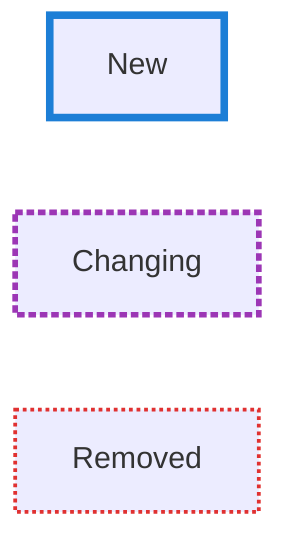
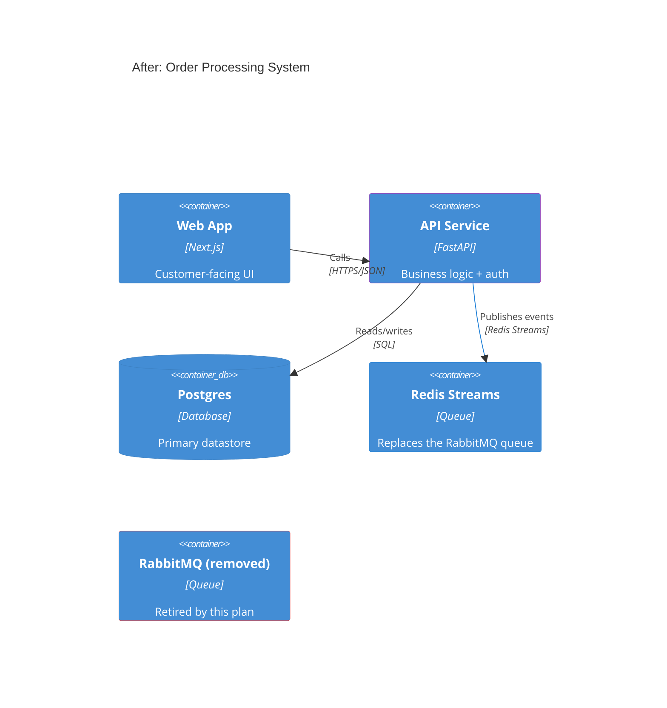
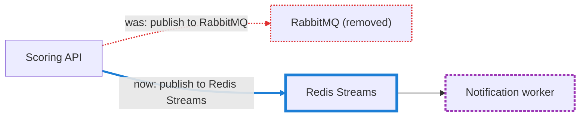

# Diagram patterns for the After diagram

The Before diagram is just an accurate, unstyled diagram of the system
today (see SKILL.md — it's reality-check's graded diagram with the grading
stripped). The After diagram is where styling comes back, but for a
different purpose: marking what the plan actually changes, not grading
correctness. Don't reuse reality-check's red/amber/green grading vocabulary
here — a reader who's seen both skills would read "red" as "wrong," not
"being removed." Use a distinct palette:

```
classDef planNew      stroke:#1c7ed6,stroke-width:4px;
classDef planChanging stroke:#9c36b5,stroke-width:3px,stroke-dasharray: 4 2;
classDef planRemoved  stroke:#e03131,stroke-width:2px,stroke-dasharray: 2 2;
```

| Class | Meaning | Pattern |
|---|---|---|
| `planNew` | Doesn't exist today; the plan adds it | solid, thick |
| `planChanging` | Exists today; the plan modifies its behavior, config, or role | medium dash |
| `planRemoved` | Exists today; the plan removes or replaces it | tight dash, thinner |
| *(no class)* | Untouched by the plan | plain |

Label a `planRemoved` node with what's happening to it, not just its old
name — a bare struck-through-looking node reads as "broken," not
"intentionally retired": `oldQueue["RabbitMQ queue (removed)"]:::planRemoved`.

## Legend block



## C4 (architecture lens)

Same `UpdateElementStyle` / `UpdateRelStyle` mechanism reality-check
repurposes for grading, used here for its original purpose — marking a
delta:



Leave the `oldQueue` container in the diagram (don't just delete it from
the After diagram) when showing it's being retired matters to the plan —
an element that silently disappears between Before and After is harder to
read than one explicitly marked removed. Omit it entirely only when its
removal isn't itself something the plan needs to call attention to.

## Flowchart (deployment / data-flow lens)

Same `linkStyle`-by-edge-index mechanism as reality-check's flowchart edge
grading (see its mermaid-patterns.md for the indexing caveat — recount
edges in source order before finalizing):



When a node is only being reconfigured (still there, still doing roughly
the same job, but its behavior changes) prefer `planChanging` over
deleting and re-adding it as `planRemoved` + `planNew` — that pair reads as
a replacement, not a modification, and overstates the size of the change.
