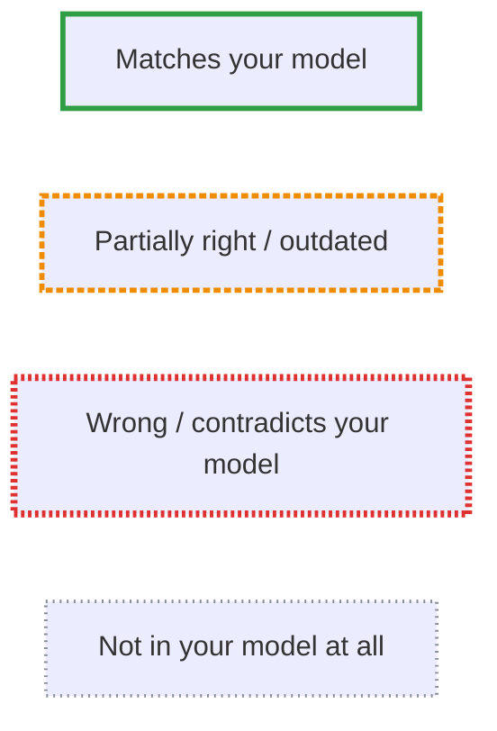
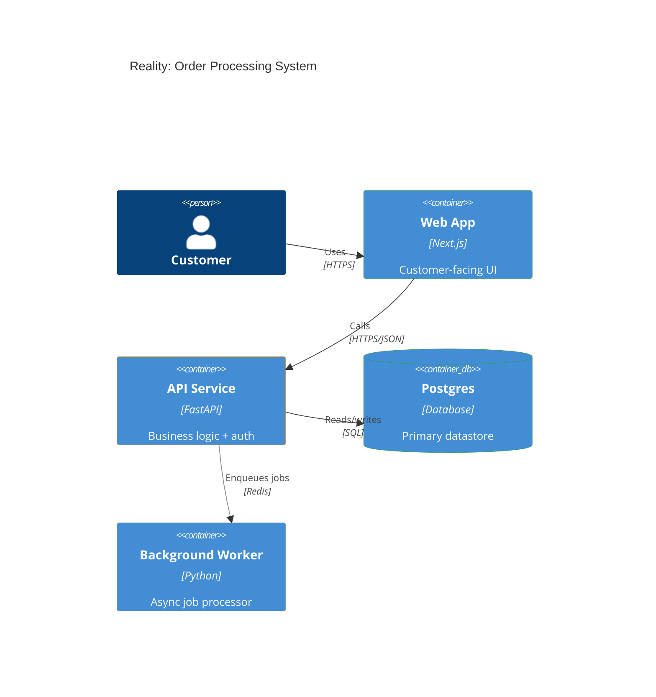
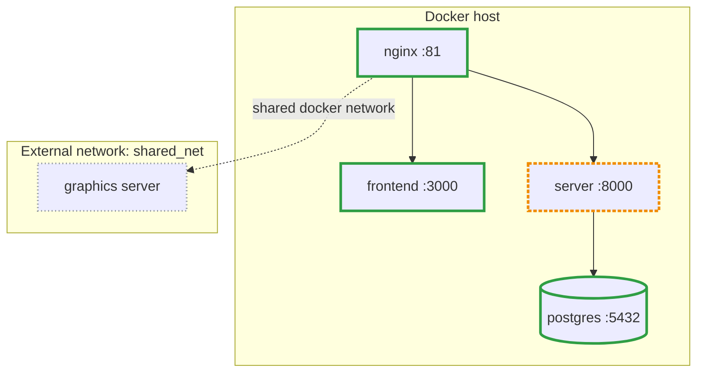
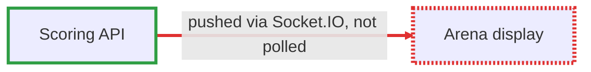
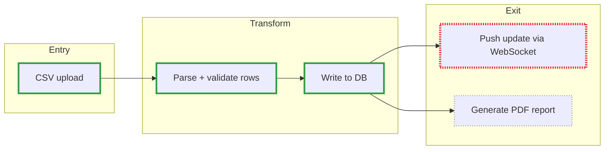

# Mermaid patterns for reality-check reports

Copy-paste starting points for the "reality" diagram in a reality-check
report. Reuse the same four grade styles and hex values every time so
reports stay visually consistent across runs and repos.

## The four grades

Use outlines/borders only — never change fill color — so grading doesn't
fight with any other meaning color might already carry (team ownership,
tech stack, etc.), and the diagram still reads in both light and dark
rendering. Each grade also gets a distinct stroke pattern, not just a
color, so the two easiest grades to confuse under red-green color
blindness (🔴 vs 🟢) are still distinguishable by pattern alone.

```
classDef ciGreen stroke:#2f9e44,stroke-width:3px;
classDef ciAmber stroke:#f08c00,stroke-width:3px,stroke-dasharray: 4 2;
classDef ciRed   stroke:#e03131,stroke-width:4px,stroke-dasharray: 2 2;
classDef ciGrey  stroke:#868e96,stroke-width:2px,stroke-dasharray: 1 3;
```

| Class | Meaning | Pattern |
|---|---|---|
| `ciGreen` | Matches the stated model | solid |
| `ciAmber` | Partially right / outdated / incomplete | medium dash |
| `ciRed` | Wrong / contradicted by the code | tight dash, thicker |
| `ciGrey` | Real, but absent from the stated model | fine dotted |

## Legend block (flowchart form)

Drop this in as its own `subgraph` inside a flowchart diagram, or as a
standalone tiny diagram right after a C4 diagram (C4 diagrams can't embed a
flowchart subgraph inside themselves):



## Architecture (C4-style)

Mermaid's C4 diagrams (`C4Context`, `C4Container`, `C4Component`) have a
built-in mechanism for exactly this — `UpdateElementStyle` and
`UpdateRelStyle`, originally meant for highlighting incremental changes.
Repurpose `$borderColor` for the grade:



Here `webApp` and `db` matched the user's model (green), `api` was
partially right (amber — say why in the evidence table: e.g. "user thought
auth lived here too; it's actually in a separate service"), and `worker`
was a component the user never mentioned at all (grey) — a gap, not a wrong
belief.

Pick the C4 level to match scope: `C4Context` for a system landscape,
`C4Container` for one service's internals, `C4Component` for a single
module or feature. Don't reach for `C4Context` by default — it's the
least informative level and often too zoomed-out to show what actually
changed.

## Deployment

Mermaid has no dedicated "deployment diagram" type. A flowchart with
subgraphs as host/network boundaries reads clearly and renders everywhere
(GitHub, VS Code, most Markdown viewers). If your rendering target is known
to support newer Mermaid (`architecture-beta`), it's a fine alternative —
but flowchart is the safe default since `architecture-beta` support is
inconsistent across renderers as of this writing.



Group by physical/network boundary (host, container, external network,
managed cloud service), not by codebase folder — a deployment diagram
answers "what talks to what over the wire," which often cuts across the
source tree.

## Grading a relationship, not a component

Some findings are about a *component* ("GraphicsServer exists and you never
mentioned it") and some are about *how two things connect* ("you said
polling, it's actually a push over Socket.IO"). The second kind belongs on
the edge, not on an extra node — inventing a node to carry an edge-shaped
finding (e.g. a `poll["polls every few seconds"]` node sitting on the arrow)
just moves the finding off the connection it's actually about and makes the
diagram harder to read as a graph. Grade edges directly instead.

**C4 diagrams** already have `UpdateRelStyle` for this (see the Architecture
section above) — use it on every `Rel(...)` whose claim was wrong or
outdated, and put the specific correction in the relationship's own label
text, not only in the evidence table:

```
Rel(webapp, server, "Live scores pushed via Socket.IO", "not polled")
UpdateRelStyle(webapp, server, $lineColor="#e03131", $offsetY="-20")
```

**Flowcharts** don't have a per-edge classDef, but Mermaid's `linkStyle`
targets an edge by its position in the diagram — edges are numbered `0, 1,
2, ...` in the order they're written in the source, across the whole
diagram (subgraphs don't restart the count):



Reuse the same grade hex values as the node `classDef`s
(`#2f9e44`/`#f08c00`/`#e03131`/`#868e96`) so an edge's color means the same
thing a node's outline does. Before finalizing, recount the edges in
diagram-source order and double check the `linkStyle` index actually points
at the edge you mean — it's easy to miscount once a diagram has more than a
handful of arrows, and a `linkStyle` on the wrong index silently colors the
wrong connection instead of erroring.

Put the finding itself in the edge's label (`-->|"..."|`) so the diagram
states it directly; the evidence table entry for that row is then just the
citation (file/line), not a restatement of what the arrow already says.

## Data flow

A left-to-right flowchart following one or two concrete flows end-to-end
reads better than a diagram trying to show every possible path:



Here the user believed updates went out over raw WebSockets when the code
actually uses a different real-time mechanism (red — flag exactly what the
code uses instead in the evidence table), and PDF generation was a step
they didn't know existed at all (grey).

## "Your model" diagram

Use the same diagram type as the reality diagram (flowchart for
deployment/data-flow, C4 for architecture) but with **no classDef/styling
at all** — it's a faithful, neutral rendering of what the user said, not a
verdict. Don't grade this one; only the reality diagram carries grades.
